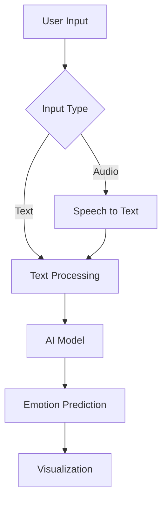

<div align="center">

# 🎧 Voice Sentiment AI


<br>


<br><br>

🌐 **Live Demo**
👉 https://voice-sentiment-app.streamlit.app/

<br>

<div align="center">

## 👁️ Visitors & Stats


<br><br>


</div>


</div>

---

## 🖼️ Preview

<div align="center">

    

<br><br>

    

<br><br>

    

</div>

---

## 🧠 Overview

Voice Sentiment AI is a futuristic AI-powered web application that analyzes emotions from:

* 📝 Text input
* 🎤 Voice input

Using advanced NLP models, it detects:

> 😄 Joy • 😢 Sadness • 😡 Anger • 😨 Fear • 😐 Neutral • 😮 Surprise

---

## ✨ Features

* 🔐 Login & Register system
* 🎧 Voice-to-text emotion detection
* 📝 Text sentiment analysis
* 📊 Real-time emotion charts
* 🌌 Futuristic UI (neon + glassmorphism)
* ⚡ Smooth animations + wave effects

---

## 🏗️ Architecture



---

## ⚙️ Tech Stack

| Layer      | Technology        |
| ---------- | ----------------- |
| Frontend   | Streamlit         |
| Backend    | Python            |
| AI         | Transformers      |
| Speech     | SpeechRecognition |
| Deployment | Streamlit Cloud   |

---

## 📦 Installation

```bash
git clone https://github.com/YOUR_USERNAME/YOUR_REPO.git
cd voice-sentiment-ai
pip install -r requirements.txt
streamlit run app.py
```

---

## 📄 Requirements

```txt
streamlit
transformers
torch
speechrecognition
```

---

## 📊 GitHub Stats

<div align="center">


</div>

---

## 🚀 Deployment

Deployed on **Streamlit Cloud**

```bash
https://voice-sentiment-app.streamlit.app/
```

---

## 🔮 Future Enhancements

* 🎤 Live mic recording
* 🧾 Emotion history
* 🔐 Secure auth (DB)
* 🌍 Multi-language support

---

## 👨‍💻 Author

<div align="center">

**Prerna Sharma**

🚀 Building AI-powered experiences

</div>

---

## ⭐ Support

If you like this project:

⭐ Star the repo
🔁 Share it
🍴 Fork it

---

<div align="center">

✨ *“Turning voice into emotions with AI”* ✨

</div>
